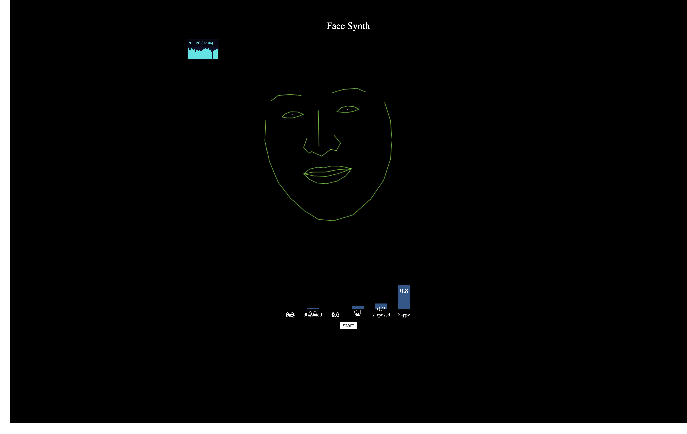

# Face Synth

Make music (?) with your face.



## Contributors

- [Christina Li](https://github.com/cli3267)
- [Joseph Sayad](https://github.com/josephsayad)
- [Will Holley](https://github.com/will-holley)

## About

Project for 07-08-2019 [Monthly Music Hackathon NYC](https://monthlymusichackathon.org/) entitled *Movement & Music*.

## Development

```bash
# In your terminal
python3 -m http.server
# In your browser, navigate to
# http://localhost:8000/
```

## Inspired By

- https://www.auduno.com/clmtrackr/examples/clm_emotiondetection.html